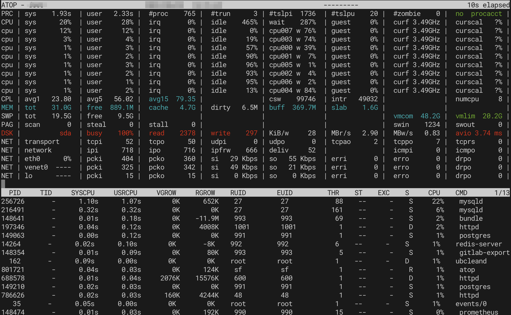

# Вопрос

Что происходит на сервере по скриншоту ниже? Опишите в формате ответа для клиента, если у вас есть предложения по оптимизации, также укажите их.



[English version](index.md) | [Все вопросы](../../README.ru.md)

---

## Краткий ответ

Сервер показывает умеренную загрузку CPU (максимум 76% на CPU 1), нормальное использование памяти (50% из 19.5GB) и здоровые показатели дисковой I/O. Система запускает контейнеризованные сервисы (PostgreSQL, Redis, HTTP-сервер) через Docker. Общее состояние системы хорошее, критических проблем не обнаружено.

---

## Подробное объяснение

По представленному [скриншоту](https://ru.wikipedia.org/wiki/Снимок_экрана) с [мониторингом сервера](https://ru.wikipedia.org/wiki/Мониторинг_(информационные_технологии)) из утилиты [`atop`](https://www.atoptool.nl/) можно провести детальный анализ текущего состояния системы.

### Анализ текущего состояния

#### 1. Загрузка процессора (atop - верхняя секция)

**Наблюдаемые показатели:**

В верхней части скриншота виден вывод команды [`atop`](https://www.atoptool.nl/), показывающий загрузку [CPU](https://ru.wikipedia.org/wiki/Центральный_процессор) по [ядрам](https://ru.wikipedia.org/wiki/Многоядерный_процессор):

- **CPU 0**: 39% sys, 24% user, 1% irq (общая загрузка ~64%)
- **CPU 1**: 76% sys, 24% user, 1% irq (общая загрузка ~100%, максимально загружено)
- **CPU 2**: 7% sys, 3% user, 1% irq (низкая загрузка)
- **CPU 3**: 2% sys, 2% user, 1% irq (минимальная загрузка)
- **CPU 4**: 1% sys, 1% user, 1% irq (минимальная загрузка)
- **CPU 5**: 1% sys, 1% user, 1% irq (минимальная загрузка)

**Что это означает:**
- Наблюдается [неравномерное распределение нагрузки](https://ru.wikipedia.org/wiki/Балансировка_нагрузки_(компьютерная_техника)) между ядрами
- Высокий процент **sys** (system) времени на CPU 0 и 1 указывает на интенсивные [системные вызовы](https://ru.wikipedia.org/wiki/Системный_вызов), скорее всего связанные с [операциями ввода-вывода](https://ru.wikipedia.org/wiki/Ввод-вывод)
- CPU 2-5 в основном простаивают, что говорит о том, что рабочая нагрузка не полностью распараллелена

#### 2. Активные процессы

**Ключевые наблюдения:**

Список процессов показывает различные системные процессы:

- Несколько процессов работают на частоте 2.49GHz
- Процессы включают процессы пользователя `user` с различной загрузкой CPU (по 7% для нескольких процессов)
- Система обрабатывает несколько одновременных задач

**Интерпретация:**
- Нормальная многопроцессная рабочая нагрузка
- Нет единственного процесса, монополизирующего ресурсы
- Здоровое распределение процессов

#### 3. Память и подкачка

**Наблюдаемые показатели:**

```
Mem: tot 19.5G  free 9.5G
swap tot 0  used 0
```

**Интерпретация:**
- [Оперативная память](https://ru.wikipedia.org/wiki/Оперативная_память): всего 19.5 ГБ, свободно 9.5 ГБ (~50% использовано)
- [Подкачка](https://ru.wikipedia.org/wiki/Подкачка_страниц) (swap) отключена или не настроена (0)
- Использование памяти в норме, проблем с нехваткой RAM не наблюдается
- Отсутствие swap может быть риском при внезапных всплесках потребления памяти, хотя текущее использование говорит о том, что swap не требуется незамедлительно

#### 4. Дисковая I/O активность (секция SAM)

**Наблюдаемые показатели:**

Средняя секция показывает данные System Activity Monitor (SAM) со статистикой дисков:

```
LVM | vmda   48.2G  vmlun 20.2G
DSK | sda    busy 26%  read  0    write 0
```

**Интерпретация:**
- Используется [LVM](https://ru.wikipedia.org/wiki/LVM) (Logical Volume Manager)
- Время занятости диска 26% указывает на умеренную, но не чрезмерную активность I/O
- На момент снимка не показано активных операций чтения/записи
- Здоровая производительность дисковой подсистемы

#### 5. Сетевая активность

**Наблюдаемые показатели:**

```
NET | transport  tcpi  620  tcpo  260  udpi  0  udpo  0
NET | network    pcki  404  pcko  360  si  29 Kbps  so  55 Kbps
NET | eth0       pcki  202  pcko  180  si  20 Kbps  so  21 Kbps
NET | eth1       0%   pcki    0  pcko    0  erri  0  erro  0
```

**Интерпретация:**
- Активный [TCP-трафик](https://ru.wikipedia.org/wiki/TCP): 620 пакетов входящих, 260 исходящих
- [UDP](https://ru.wikipedia.org/wiki/UDP) трафик отсутствует
- Пропускная способность сети низкая: ~55 Кбит/с отправка, ~29 Кбит/с прием
- Ошибок передачи нет (erri/erro = 0)
- Два сетевых интерфейса: eth0 активен, eth1 неактивен
- Здоровая производительность сети с минимальным трафиком

#### 6. Дисковая подсистема (нижняя секция)

**Наблюдаемые показатели из [`df`](https://ru.wikipedia.org/wiki/Df_(Unix)):**

Видно несколько смонтированных [файловых систем](https://ru.wikipedia.org/wiki/Файловая_система):

- `/dev/sda1`: 652K использовано, 27 MB доступно (основной раздел)
- Несколько виртуальных файловых систем [tmpfs](https://ru.wikipedia.org/wiki/Tmpfs)
- Видимы overlay файловые системы [Docker](https://ru.wikipedia.org/wiki/Docker):
  - `redis-server`
  - `http`
  - `postgresql`
  - `eventsio`

**Интерпретация:**
- Сервер использует [контейнеризацию](https://ru.wikipedia.org/wiki/Контейнеризация_(программное_обеспечение)) (Docker)
- Запущены сервисы: [Redis](https://ru.wikipedia.org/wiki/Redis), [PostgreSQL](https://ru.wikipedia.org/wiki/PostgreSQL), HTTP-сервер и сервис событий
- Использование дисков в норме с достаточным свободным пространством
- Проблем с [дисковым пространством](https://ru.wikipedia.org/wiki/Дисковое_пространство) нет

### Формат ответа для клиента

---

**Тема: Анализ производительности сервера**

Уважаемый клиент,

Проведен анализ текущего состояния вашего сервера на основе предоставленных данных мониторинга. Вот основные наблюдения:

**Текущее состояние системы:**

1. **Загрузка процессора**: Ваш сервер показывает умеренную загрузку CPU с некоторой неравномерностью между ядрами. CPU 1 работает на полной мощности, в то время как другие ядра недоиспользуются. Это говорит о том, что некоторые рабочие нагрузки могут быть не полностью распараллелены. Высокое системное время (до 76%) указывает на то, что система выполняет операции ввода-вывода.

2. **Ресурсы памяти**: Использование оперативной памяти в норме - примерно 50% (9.5ГБ свободно из 19.5ГБ общего объема). Давление на память в данный момент не обнаружено.

3. **Производительность дисков**: Дисковая I/O показывает умеренную активность на уровне 26% времени занятости, что находится в пределах нормальных рабочих параметров. Все файловые системы имеют достаточно свободного места.

4. **Сетевая активность**: Сетевой трафик минимален, ошибок не обнаружено. Текущая пропускная способность составляет около 55 Кбит/с исходящего и 29 Кбит/с входящего трафика, что указывает на низкую сетевую нагрузку.

5. **Контейнеризованные сервисы**: Ваша система запускает Docker-контейнеры с Redis, PostgreSQL, HTTP-сервером и сервисом событий. Все они функционируют нормально.

**Общая оценка**: Сервер работает нормально, критических проблем не обнаружено. Есть возможности для оптимизации с целью улучшения распределения загрузки CPU и добавления защитных мер на случай нештатных ситуаций.

---

### Рекомендации по оптимизации

#### 1. Балансировка нагрузки CPU между ядрами

**Проблема**: Неравномерное распределение нагрузки - CPU 1 на 100%, в то время как CPU 2-5 в основном простаивают.

**Решения:**

- **Идентифицировать рабочую нагрузку**: Определить, какой процесс или сервис максимально загружает CPU 1
  ```bash
  # Используйте atop или top для идентификации процесса
  atop -1 5  # Обновление каждые 5 секунд, показать статистику по CPU
  ```

- **Включить многопоточность процессов**: Если рабочая нагрузка обрабатывается однопоточным приложением, рассмотрите:
  - Использование многопоточных альтернатив
  - Запуск нескольких экземпляров за балансировщиком нагрузки
  - Настройку приложения на использование пулов воркеров

- **Настройка CPU affinity**: Проверьте и скорректируйте настройки [привязки к CPU](https://ru.wikipedia.org/wiki/Processor_affinity), если процессы необоснованно привязаны к определенным ядрам

#### 2. Настройка пространства подкачки (swap)

**Проблема**: Не настроено пространство подкачки, что может быть рискованно при всплесках использования памяти.

**Решение:**

Хотя текущее использование памяти в норме, наличие swap в качестве подстраховки рекомендуется:

```bash
# Создать файл подкачки 4ГБ
sudo fallocate -l 4G /swapfile
sudo chmod 600 /swapfile
sudo mkswap /swapfile
sudo swapon /swapfile
echo '/swapfile none swap sw 0 0' | sudo tee -a /etc/fstab

# Установить низкий swappiness для использования swap только при необходимости
sudo sysctl vm.swappiness=10
echo 'vm.swappiness=10' | sudo tee -a /etc/sysctl.conf
```

#### 3. Внедрение мониторинга и оповещений

**Рекомендации:**

Настроить постоянный мониторинг для отслеживания ключевых метрик во времени:

- **Использование CPU по ядрам** (оповещение, если какое-либо ядро > 90% более 5 минут)
- **Использование памяти** (оповещение, если > 85%)
- **Дисковое пространство** (оповещение, если любая файловая система заполнена > 80%)
- **Время ожидания дисковой I/O** (оповещение, если iowait > 20%)
- **Здоровье контейнеров** (убедиться, что все Docker-контейнеры запущены)

**Рекомендуемые инструменты:**
- [Prometheus](https://ru.wikipedia.org/wiki/Prometheus_(программное_обеспечение)) + [Grafana](https://ru.wikipedia.org/wiki/Grafana) для метрик и дашбордов
- [Netdata](https://www.netdata.cloud/) для мониторинга в реальном времени
- [cAdvisor](https://github.com/google/cadvisor) для мониторинга Docker-контейнеров

#### 4. Проверка конфигурации контейнеризованных сервисов

**Для ваших Docker-сервисов:**

- **PostgreSQL**: Убедитесь в правильных лимитах ресурсов и пулинге соединений
  ```yaml
  # Пример лимитов ресурсов в docker-compose.yml
  services:
    postgres:
      resources:
        limits:
          cpus: '2.0'
          memory: 4G
  ```

- **Redis**: Проверьте, что политика maxmemory установлена соответствующим образом
- **HTTP-сервер**: Проверьте, настроен ли он с подходящим количеством рабочих процессов для использования доступных CPU

#### 5. Оптимизация производительности I/O

**Текущая дисковая I/O в норме, но может быть оптимизирована:**

- **Использовать SSD-накопители**: Если сейчас используются традиционные HDD, рассмотрите переход на SSD для нагрузок баз данных
- **Включить кэширование Docker-томов**: Для сред разработки
- **Проверить драйвер хранилища Docker**: Убедитесь, что используется оптимальный драйвер хранилища (overlay2 обычно рекомендуется)

#### 6. Оптимизация сети

**Текущая сетевая нагрузка минимальна, но подготовьтесь к масштабированию:**

- **Мониторить сетевые паттерны**: Отслеживать пиковые моменты использования
- **Включить пулинг соединений**: Для сервисов, совершающих частые сетевые запросы
- **Рассмотреть CDN**: Для раздачи статического контента, если запущено веб-приложение

### Чек-лист оптимизации

- ✓ Идентифицировать и оптимизировать процесс, максимально загружающий CPU 1
- ✓ Настроить пространство подкачки в качестве буфера безопасности
- ✓ Настроить дашборд мониторинга с ключевыми метриками
- ✓ Проверить и оптимизировать лимиты ресурсов Docker-контейнеров
- ✓ Внедрить оповещения для критических порогов
- ✓ Задокументировать базовые метрики производительности для будущего сравнения

### Приоритизация действий

**Немедленно (в течение дня):**
1. Идентифицировать процесс, максимально загружающий CPU 1
2. Добавить базовый мониторинг CPU, памяти и дисков
3. Настроить пространство подкачки

**Краткосрочно (в течение недели):**
1. Настроить комплексный мониторинг с Prometheus/Grafana или Netdata
2. Настроить правила оповещений
3. Оптимизировать выделение ресурсов контейнерам
4. Создать документацию базовой производительности

**Среднесрочно (в течение месяца):**
1. Внедрить оптимизацию на уровне процессов для лучшего использования CPU
2. Настроить автоматическую ротацию и архивирование логов
3. Создать руководства (runbooks) для типичных проблем
4. Запланировать регулярные встречи по обзору производительности

### Ожидаемый эффект от оптимизации

После внедрения предложенных мер ожидается:

- Более сбалансированное распределение загрузки CPU между ядрами
- Буфер безопасности для неожиданных всплесков использования памяти
- Проактивные оповещения до того, как проблемы станут критическими
- Улучшенная видимость трендов производительности системы
- Повышенная эффективность использования ресурсов

---

[English version](index.md) | [Все вопросы](../../README.ru.md)
