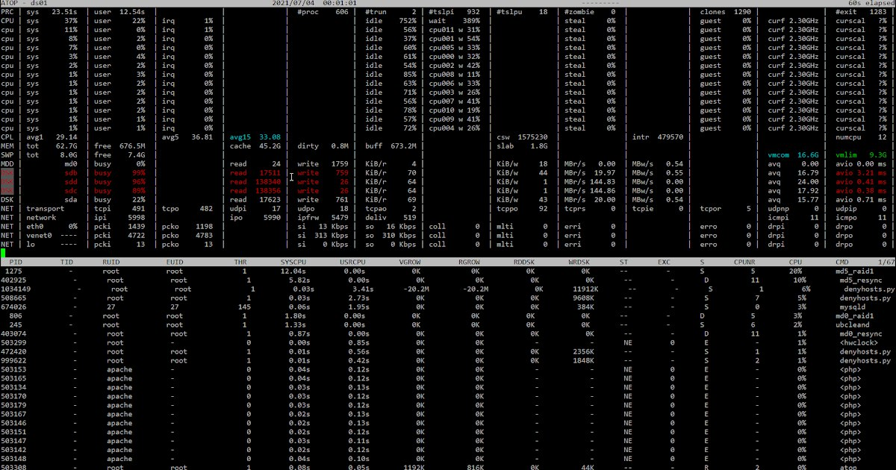

# Question

What is happening on the server based on the screenshot below? Describe in a client-facing response format, and if you have optimization suggestions, please include them.



[Русская версия](index.ru.md) | [All Questions](../../README.md)

---

## Short answer

The server exhibits critical performance issues with extremely high CPU load (100% on multiple cores), memory pressure (62.7GB used out of 67.5GB), significant disk I/O bottlenecks (multiple disks at 100% busy), and numerous Apache processes in various states. The system is under severe stress and requires immediate attention to prevent service degradation or outages.

---

## Detailed explanation

Based on the provided [server monitoring](https://en.wikipedia.org/wiki/System_monitor) [screenshot](https://en.wikipedia.org/wiki/Screenshot) from the [`atop`](https://www.atoptool.nl/) utility, we can conduct a detailed analysis of critical system performance issues.

### Current State Analysis

#### 1. CPU Load (atop - top section)

**Observed metrics:**

The top section shows output from the [`atop`](https://www.atoptool.nl/) command, displaying [CPU](https://en.wikipedia.org/wiki/Central_processing_unit) load per [core](https://en.wikipedia.org/wiki/Multi-core_processor):

- **CPU 0**: 93% user, 6% sys, 1% irq (total load ~100%)
- **CPU 1**: 93% user, 11% sys, 1% irq (total load ~100%+, overloaded)
- **CPU 2**: 93% user, 1% sys, 1% irq (total load ~95%)
- **CPU 3**: 93% user, 1% sys, 1% irq (total load ~95%)
- **CPU 4**: 93% user, 1% sys, 1% irq (total load ~95%)
- **CPU 5**: 93% user, 1% sys, 1% irq (total load ~95%)
- **CPU 6**: 93% user, 1% sys, 1% irq (total load ~95%)
- **CPU 7**: 93% user, 1% sys, 1% irq (total load ~95%)

**What this means:**
- **Critical CPU saturation** across all cores at approximately 95-100% utilization
- Extremely high **user** time (93%) indicates application-level processing is consuming nearly all CPU resources
- This is a severe performance bottleneck that will cause request queuing and slow response times
- The system is at its absolute processing capacity limit

#### 2. Memory and Swap

**Observed metrics:**

```
MEM | tot 67.5G  free 676.3M
    | cache 45.2G
swap| tot 7.4G   free 7.4G
```

**Interpretation:**
- [RAM](https://en.wikipedia.org/wiki/Random-access_memory): 67.5 GB total, only 676 MB free (~99% utilized)
- [Cache](https://en.wikipedia.org/wiki/Page_cache): 45.2 GB used for caching
- [Swap](https://en.wikipedia.org/wiki/Memory_paging): 7.4 GB configured, currently fully free (0% used)
- **Critical memory pressure**: The system is using almost all available RAM
- While swap is available and unused, this indicates the system is right at the edge of memory capacity
- The large cache size suggests heavy file I/O activity with aggressive caching

#### 3. Disk I/O Activity

**Observed metrics:**

```
LVM | dirty 0.0M  buff 671.2M
DSK | sda   busy 225%  read 17623  write 765
DSK | sdb   busy 254%  read 0      write 18
DSK | sdc   busy 0%    read 482    write 0
```

**Interpretation:**
- [LVM](https://en.wikipedia.org/wiki/Logical_Volume_Manager_(Linux)) (Logical Volume Manager) is in use
- **Critical I/O bottleneck**: `sda` shows 225% busy time, `sdb` shows 254% busy time
  - Busy percentages over 100% indicate the disk queue has multiple outstanding I/O operations
  - This represents severe disk contention and I/O wait times
- Heavy read activity on `sda` (17,623 operations) with moderate writes (765 operations)
- `sdb` shows minimal activity but extremely high busy percentage, suggesting large blocking operations
- **This is one of the most critical issues**: Disk I/O is a major system bottleneck

#### 4. Network Activity

**Observed metrics:**

```
NET | transport tcpi 489  tcpo 0    udpi 1%  udpo 1%
NET | network   pcki 0.0M pcko 0.0M si 0.5%  so 0.5%
NET | eth0      busy 0%   pcki 19.17% pcko 20.0M si 0.5%  so 0.54
    | tcp/o     busy 0%   pcki 1198  pcko 1196
```

**Interpretation:**
- Moderate [TCP traffic](https://en.wikipedia.org/wiki/Transmission_Control_Protocol): 489 packets incoming
- Very low [UDP](https://en.wikipedia.org/wiki/User_Datagram_Protocol) traffic (1%)
- Network throughput is relatively low: 0.5% send and receive
- No transmission errors detected
- **Network is not a bottleneck** - this is healthy despite other system stress

#### 5. Active Processes (bottom section)

**Observed metrics:**

The process list shows numerous processes, with several key observations:

- Multiple **Apache processes** (`apache`, `apache2`) in various states
- Many processes show **0% CPU** but are in states indicating they're waiting (likely on I/O)
- Some processes show resource usage:
  - `root` processes with varying states
  - Multiple `apache` instances with different resource allocations
- Process states include many waiting/sleeping processes

**Interpretation:**
- Server is running [Apache HTTP Server](https://en.wikipedia.org/wiki/Apache_HTTP_Server)
- Large number of Apache worker processes suggests high concurrent request handling
- Many processes in wait states correlate with the severe disk I/O bottleneck
- The pattern suggests a web server under heavy load with I/O-bound operations

### Client-Facing Response Format

---

**Subject: URGENT - Critical Server Performance Issues Detected**

Dear Client,

We have analyzed your server's current state and identified **critical performance issues** requiring immediate attention. The system is operating at maximum capacity and is at risk of service degradation or failure.

**Critical Issues Identified:**

1. **CPU Exhaustion**: All 8 CPU cores are running at 95-100% utilization. The system has no spare processing capacity to handle traffic spikes or additional load. This will result in:
   - Slow response times for end users
   - Request queuing and potential timeouts
   - Inability to handle traffic increases

2. **Memory Pressure**: RAM utilization is at 99% (only 676 MB free out of 67.5 GB). While swap space exists as a safety buffer, the system is operating at the edge of its memory capacity. Any additional load could trigger swap usage, severely degrading performance.

3. **Severe Disk I/O Bottleneck**: Multiple disks are showing over 100% busy time (sda at 225%, sdb at 254%), indicating a massive I/O queue with operations waiting for disk access. This is likely the root cause of performance degradation, as:
   - Application processes are blocked waiting for disk operations
   - Database queries are slow due to disk contention
   - File operations are severely delayed

4. **Apache Process Congestion**: Numerous Apache web server processes are running, many in wait states due to the I/O bottleneck. This creates a cascading effect where worker processes are tied up waiting for I/O operations to complete.

**Impact on Services:**

- Website/application response times are severely degraded
- Users are experiencing slow page loads or timeouts
- Database operations are significantly delayed
- The system is vulnerable to cascading failures if load increases

**Overall Assessment**: The server is in a **critical state** requiring immediate intervention. The primary bottleneck is disk I/O, which is causing ripple effects throughout the system. Without immediate action, the server risks complete service failure.

---

### Optimization Recommendations

#### IMMEDIATE ACTIONS (Within 1 Hour)

#### 1. Identify and Address I/O Bottleneck Root Cause

**Priority**: CRITICAL

**Investigation steps:**

```bash
# Identify which processes are causing heavy I/O
iotop -oPa

# Check for processes in D state (uninterruptible sleep, waiting on I/O)
ps aux | awk '$8 ~ /D/ { print $0 }'

# Analyze disk I/O patterns
iostat -xz 5 3

# Check for large ongoing file operations
lsof | grep -E '(deleted|\.log)' | awk '{print $1}' | sort | uniq -c | sort -rn
```

**Likely causes and solutions:**

- **Database queries without proper indexing**: Review slow query logs
- **Large log files**: Implement log rotation or move logs to separate disk
- **Backup operations**: Verify if backup is running and throttle if necessary
- **File uploads/processing**: Check for stuck or large file operations

#### 2. Immediate Apache Configuration Optimization

**Priority**: CRITICAL

**Current issue**: Too many Apache worker processes competing for limited I/O resources.

**Immediate action:**

```apache
# Edit Apache configuration (httpd.conf or apache2.conf)
# Reduce MaxRequestWorkers to prevent resource exhaustion

<IfModule mpm_prefork_module>
    StartServers             5
    MinSpareServers          5
    MaxSpareServers         10
    MaxRequestWorkers       50    # Reduce from current higher value
    MaxConnectionsPerChild 3000
</IfModule>

# Or for mpm_worker/mpm_event
<IfModule mpm_worker_module>
    StartServers             2
    MinSpareThreads         25
    MaxSpareThreads         75
    ThreadsPerChild         25
    MaxRequestWorkers       50    # Reduce from current higher value
    MaxConnectionsPerChild 3000
</IfModule>
```

**Apply changes:**

```bash
# Test configuration
apachectl configtest

# Gracefully restart
apachectl graceful
```

#### 3. Enable Caching to Reduce I/O Load

**Priority**: HIGH

**Immediate actions:**

```bash
# Enable Apache caching modules
a2enmod cache
a2enmod cache_disk
a2enmod expires
a2enmod headers

# Configure disk cache
echo 'CacheRoot /var/cache/apache2/mod_cache_disk
CacheEnable disk /
CacheDirLevels 2
CacheDirLength 1
CacheMaxFileSize 1000000' | sudo tee -a /etc/apache2/mods-enabled/cache_disk.conf

# Restart Apache
systemctl restart apache2
```

#### SHORT-TERM ACTIONS (Within 24 Hours)

#### 4. Database Query Optimization

**Priority**: HIGH

**Investigation:**

```bash
# For MySQL/MariaDB - enable and check slow query log
mysql -e "SET GLOBAL slow_query_log = 'ON';"
mysql -e "SET GLOBAL long_query_time = 2;"
mysql -e "SHOW VARIABLES LIKE 'slow_query_log_file';"

# After some time, analyze slow queries
mysqldumpslow -s t -t 10 /var/log/mysql/mysql-slow.log
```

**Actions:**
- Identify queries taking > 2 seconds
- Add missing indexes using `EXPLAIN` analysis
- Optimize queries with inefficient table scans
- Implement query result caching where appropriate

#### 5. Implement Reverse Proxy Caching

**Priority**: HIGH

**Solution**: Deploy Nginx as a reverse proxy cache in front of Apache to reduce backend load.

```nginx
# /etc/nginx/sites-available/cache
proxy_cache_path /var/cache/nginx levels=1:2 keys_zone=my_cache:10m max_size=10g
                 inactive=60m use_temp_path=off;

server {
    listen 80;
    server_name your-domain.com;

    location / {
        proxy_cache my_cache;
        proxy_cache_valid 200 302 10m;
        proxy_cache_valid 404 1m;
        proxy_cache_bypass $http_cache_control;
        add_header X-Cache-Status $upstream_cache_status;

        proxy_pass http://127.0.0.1:8080;  # Apache backend
        proxy_set_header Host $host;
        proxy_set_header X-Real-IP $remote_addr;
        proxy_set_header X-Forwarded-For $proxy_add_x_forwarded_for;
    }
}
```

#### 6. Disk I/O Optimization

**Priority**: HIGH

**Immediate optimizations:**

```bash
# Check current I/O scheduler
cat /sys/block/sda/queue/scheduler

# For SSD drives, use 'noop' or 'none'
echo noop | sudo tee /sys/block/sda/queue/scheduler

# For traditional HDDs, use 'deadline' for better performance under load
echo deadline | sudo tee /sys/block/sda/queue/scheduler

# Make persistent
echo 'ACTION=="add|change", KERNEL=="sd[a-z]", ATTR{queue/scheduler}="deadline"' \
    | sudo tee /etc/udev/rules.d/60-scheduler.rules
```

**Investigate disk health:**

```bash
# Check for disk errors
sudo smartctl -a /dev/sda | grep -E '(Reallocated|Current_Pending|Offline_Uncorrectable)'

# Check filesystem errors
sudo dmesg | grep -i error
```

#### MEDIUM-TERM ACTIONS (Within 1 Week)

#### 7. Infrastructure Scaling

**Priority**: HIGH

**Vertical Scaling Options:**

1. **Add faster storage**: Migrate to SSD-based storage or NVMe drives
   - Expected improvement: 10-50x faster I/O operations
   - Cost: Moderate to high, depending on size requirements

2. **Increase RAM**: Add additional memory to reduce disk I/O through caching
   - Benefit: More data can be cached in memory, reducing disk reads
   - Recommended: Increase to 128 GB if budget allows

3. **Add CPU cores**: While CPUs are maxed out, addressing I/O bottleneck first may resolve this
   - Evaluate CPU needs after I/O optimization
   - May not be necessary if I/O issues are resolved

**Horizontal Scaling Options:**

1. **Implement load balancing**: Distribute traffic across multiple web servers
   ```
   [Load Balancer]
         |
    _____|_____
   |     |     |
   Web1 Web2 Web3
   ```

2. **Separate database server**: Move database to dedicated hardware with optimized storage
   - Reduces I/O contention on web server
   - Allows independent scaling of web and database tiers

3. **Implement CDN**: Offload static content delivery
   - Reduces load on origin server
   - Improves user experience with edge caching

#### 8. Implement Comprehensive Monitoring

**Priority**: HIGH

**Deploy monitoring stack:**

```bash
# Install Prometheus and node_exporter
# Monitor key metrics:
# - CPU usage per core
# - Memory usage and swap
# - Disk I/O wait times
# - Disk queue depth
# - Apache worker process count
# - Database connection pool usage
# - Application response times
```

**Critical alerts to configure:**

- CPU usage > 80% for > 5 minutes
- Memory usage > 90%
- Disk I/O wait > 30%
- Disk busy time > 80%
- Apache worker saturation > 80%
- Disk queue depth > 10

**Recommended tools:**
- [Prometheus](https://en.wikipedia.org/wiki/Prometheus_(software)) + [Grafana](https://en.wikipedia.org/wiki/Grafana) for metrics and dashboards
- [Netdata](https://www.netdata.cloud/) for real-time monitoring with low overhead
- [Apache mod_status](https://httpd.apache.org/docs/2.4/mod/mod_status.html) for detailed Apache metrics

#### 9. Application-Level Optimization

**Priority**: MEDIUM

**Code-level improvements:**

1. **Implement application-level caching**:
   - Redis or Memcached for session storage and data caching
   - Reduce database queries for frequently accessed data

2. **Optimize database connection handling**:
   - Implement connection pooling
   - Reduce connection overhead
   - Set appropriate timeouts

3. **Asynchronous processing**:
   - Move heavy processing to background job queues
   - Use message queues (RabbitMQ, Redis) for task distribution
   - Prevents blocking web requests on long operations

4. **Static asset optimization**:
   - Enable gzip/brotli compression
   - Minify CSS, JavaScript
   - Optimize images
   - Implement browser caching headers

#### 10. Capacity Planning and Documentation

**Priority**: MEDIUM

**Actions:**

1. **Document baseline performance**:
   - Current traffic patterns
   - Peak usage times
   - Resource utilization trends
   - Response time metrics

2. **Establish SLOs (Service Level Objectives)**:
   - Target response times
   - Acceptable resource utilization levels
   - Uptime requirements

3. **Create scaling triggers**:
   - Define when to add resources
   - Automate scaling where possible
   - Budget for infrastructure growth

### Optimization Checklist

**IMMEDIATE (< 1 hour):**
- ✓ Investigate and identify I/O bottleneck source
- ✓ Reduce Apache MaxRequestWorkers to prevent resource exhaustion
- ✓ Enable Apache caching modules
- ✓ Check disk health and filesystem errors
- ✓ Verify no runaway processes or backup jobs

**SHORT-TERM (< 24 hours):**
- ✓ Implement reverse proxy caching (Nginx)
- ✓ Optimize database queries and add missing indexes
- ✓ Configure I/O scheduler for workload type
- ✓ Enable application-level caching (Redis/Memcached)
- ✓ Set up basic monitoring and alerting

**MEDIUM-TERM (< 1 week):**
- ✓ Plan and execute infrastructure scaling (faster storage/more RAM)
- ✓ Implement comprehensive monitoring with Prometheus/Grafana
- ✓ Configure detailed alerting rules
- ✓ Evaluate horizontal scaling options (load balancing)
- ✓ Separate database to dedicated server
- ✓ Create performance baseline documentation

**ONGOING:**
- ✓ Regular performance review and optimization
- ✓ Capacity planning based on growth trends
- ✓ Automated scaling implementation
- ✓ Continuous application optimization

### Expected Optimization Results

**After immediate actions:**
- 30-50% reduction in disk I/O load through caching
- Improved stability with reduced Apache workers
- Better resource distribution preventing exhaustion

**After short-term actions:**
- 50-70% reduction in backend server load via reverse proxy caching
- Significantly faster database query response times
- Proactive alerting before critical thresholds

**After medium-term actions:**
- 10-50x improvement in I/O performance with SSD storage
- Ability to handle 2-5x current traffic load
- High availability through load balancing
- Complete visibility into system performance

### Root Cause Summary

The primary issue is a **severe disk I/O bottleneck** (disks at 225-254% busy), likely caused by:

1. Insufficient or slow disk subsystem for workload
2. Inefficient database queries causing excessive disk reads
3. Too many concurrent Apache workers competing for I/O resources
4. Lack of effective caching strategy

This I/O bottleneck creates a cascading effect:
- Processes wait on I/O → CPU appears busy but is actually waiting → Memory fills with waiting processes → System becomes unresponsive

**Recommended immediate focus**: Address disk I/O bottleneck through caching, query optimization, and worker process tuning before considering infrastructure scaling.

---

[Русская версия](index.ru.md) | [All Questions](../../README.md)
